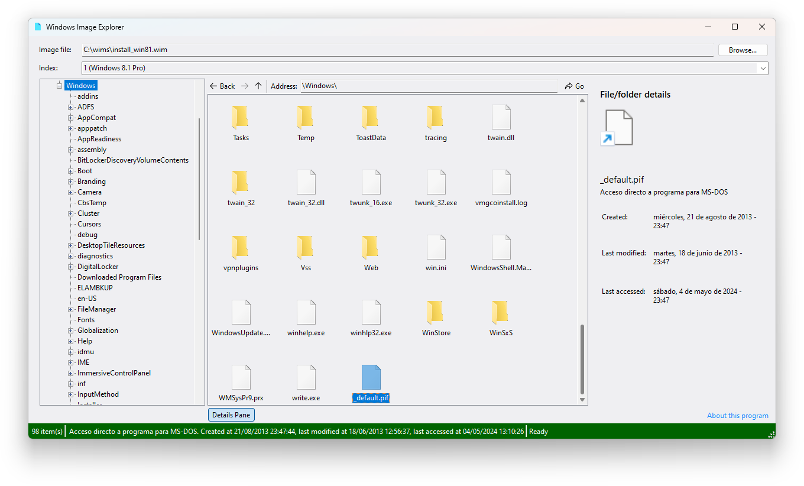

# Windows Image Explorer
The **Windows Image Explorer** is a simple file browser that lets you browse through the files of Windows images.

While it is included with DISMTools (after installation with a setup script), you can also use it as a standalone program.

## Usage

1. Pick the Windows image
2. (Optional) Pick the index
3. **Browse!**

It's that easy.

## Compiling

**Requirements:** Visual Studio 2017 or newer, [.NET Framework 4.8 Developer Pack](https://dotnet.microsoft.com/en-us/download/dotnet-framework/thank-you/net48-developer-pack-offline-installer)

> [!NOTE]
> You might be able to use older versions of Visual Studio, but compatibility varies on whether `RuntimeInformation.ProcessArchitecture` is or isn't ambiguous

1. Restore the NuGet packages (either by using the Package Manager, or `nuget restore` from CLI)
2. Build the project
3. Enjoy!

## Contributing

You can contribute to this project like this:

1. Fork this repository and create your own branch
2. Make your changes **AND TEST THEM**
3. Commit them to your fork
4. Make a pull request